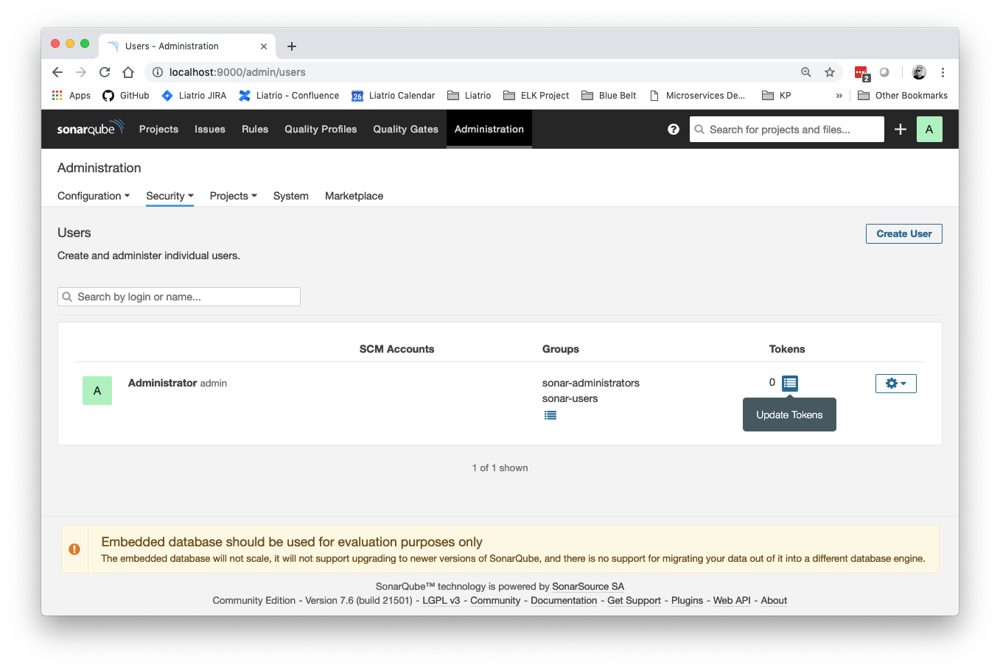
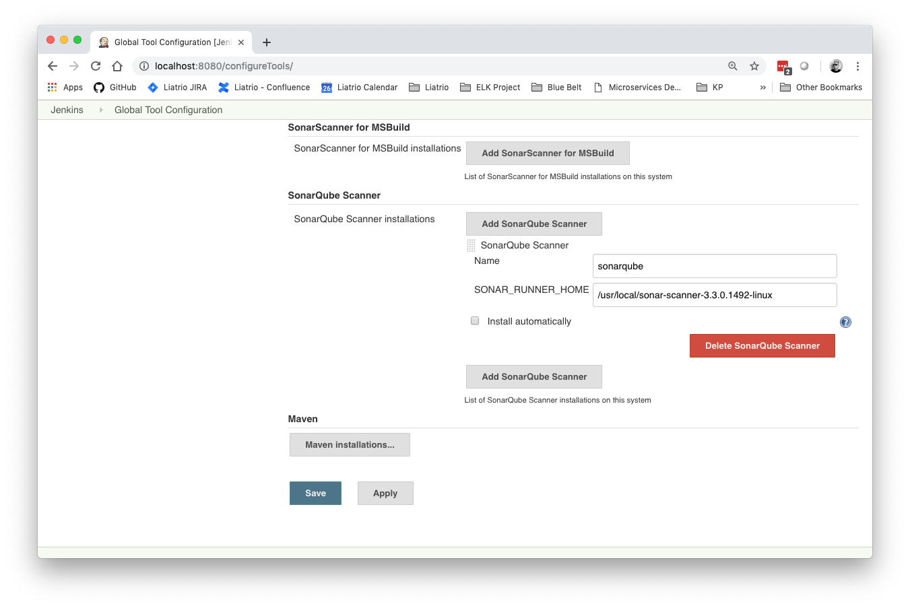
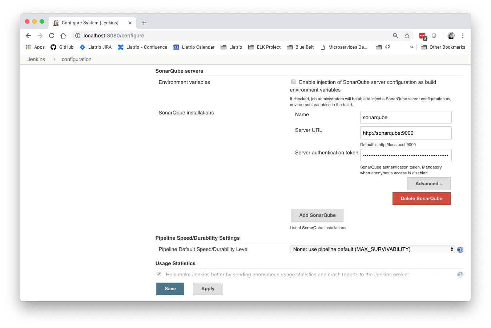
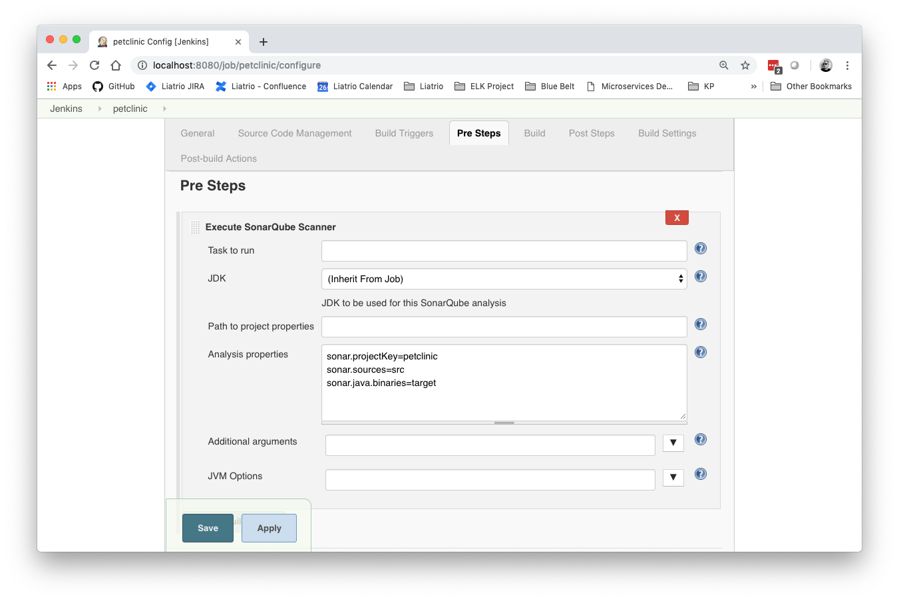

# SonarQube

[SonarQube](https://www.sonarqube.org/) is an open source source code analysis platform. It can be integrated with a variety of continuous integration tools to automate code quality tests. With minimal configuration it includes a suite of test to detect bugs, code smells and security vulnerabilities.

  
  

## Goals
This section will give you experience with:
- Installing a SonarQube server
- Installing a SonarQube scanner
- Configuring Jenkins to run the SonarQube scanner as part of a job

### Create new SonarQube service

1. Create a new virtual host and expose port 9000.
2. Install SonarQube [Installation Instructions](https://docs.sonarqube.org/latest/setup/install-server/).
3. Log into SonarQube [http://localhost:9000](http://localhost:9000). The default username and password is `admin` and `admin`.
4. Go to to Administration -> Security -> Users and click on the Update Tokens button.

5. Generate a new token and make sure to save it.

## Add SonarQube scanner to Jenkins
1. SSH into your Jenkins host.
2. Install the SonarQube Scanner [Installation Instructions](https://docs.sonarqube.org/display/SCAN/Analyzing+with+SonarQube+Scanner).
3. Open Jenkins web console [http://localhost:8080](http://localhost:8080)
4. Install the SonarQube Scanner Jenkins Plugin [Installation Instructions](https://docs.sonarqube.org/display/SCAN/Analyzing+with+SonarQube+Scanner+for+Jenkins).

## Configure Jenkins job to run SonarQube scanner
1. Go to Jenkins Global Tool Configuration and enter the path to where you installed the scanner.

2. Go to Jenkins Configure System and configure you SonarQube server.

3. Create a Spring PetClinic Maven project and in the configure the SonarQube scanner to run as a Pre Step.

4. You may need to change the Analysis properties to match the structure of the project. Note: you can also set the properties in a sonar-project.properties file in the root of the project.
5. Build your project and look at the results in SonarQube.

## Introduce SonarQube as a new phase of the pipeline
- Install the sonar plugin on Jenkins to visualize the metrics
  - https://wiki.jenkins-ci.org/display/JENKINS/SonarQube+plugin
- Install the sonar build breaker plugin or sonar quality gate status plugin so that you can break a build when it falls below the specific levels
- Adjust those levels and see things go to warning, failure, etc. 

# Deliverable

Discuss some of the advantages and disadvantages of using SonarQube in continuous integration.

