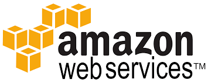

# Amazon Web Services

   

>#### This page heeds as a warning and method of passing best practices for AWS instances during the _Cloud Computing_ phase of the DevOps Bootcamp. 

### What does AWS Charge For?

AWS charges for services rendered in the form of:

- EC2 instances running. 
- Data stored on a volume for the EC2 instances. 
- Elastic IP's when the connected instance is stopped or terminated. 
- DNS information via AWS' Route53. 
- Much More but we won't need to use other products right now. 

### What Services Should We Use?

- EC2 instances during this phase should almost always be t2.micro instances. If you feel like you need bigger then make sure to verify with someone else.
- AWS Volumes in the form of Elastic Block Storage (EBS). 
- Elastic IP's and Route53 on specific instances. 
   - You shouldn't need them for this phase,  but if you feel like you do then ask. 
   - You should be using internal ip's for most of this work, it helps you to understand AWS's internal workings a bit more. 

### Guidelines For Creating An Instance 

1. Create the instance with the GUI on AWS or use the CLI with awscli. 
2. You should follow the naming convention: 
  - _your.name_-_tool_-_name_
  - example: matt-jenkins-master
  - try to keep the names to two dashes
3. Be sure to keep track of your running instances.

### When Not Using The Instance

Please make sure to stop your instance, not terminate. If you have an elastic IP attached to that instance then deallocate that address. 

### Guidelines For Destroying An Instance

1. Terminate the instance with either the GUI on AWS or use the AWS CLI. 
2. Make sure that the following have been deleted as well. 
  - EBS Volume for the instance
  - Elastic IP's for the instance. 
  - Route53 information

>#### We want you to learn how to use AWS/Cloud with DevOps so don't be frightened. Simply be mindful of your usage and have fun.

